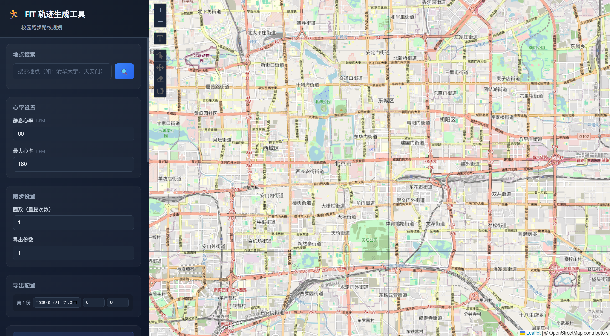

# FIT 轨迹生成工具 - Keep校园跑

[](https://github.com/Alpha-Auxiliary/fitGenerator/actions/workflows/build.yml)
[](https://github.com/Alpha-Auxiliary/fitGenerator/releases/latest)

一个基于 Web 的跑步轨迹绘制工具，可以在地图上自由绘制跑步路线，并生成符合 Garmin 标准的 FIT 运动文件。

## ✨ 功能特点

- 🗺️ **地图绘制**：在地图上自由手绘跑步轨迹
- 🔍 **地点搜索**：支持中文搜索，快速定位到任何地点
- ⚙️ **参数配置**：自定义心率、配速、圈数等参数
- 📊 **数据预览**：实时预览配速和心率曲线
- 📥 **批量导出**：支持一次生成多个不同时间的 FIT 文件
- 🎨 **精美界面**：支持深色/浅色主题，响应式设计
- 📦 **免安装运行**：提供打包好的单文件 EXE，双击即用，自动开启浏览器

## 🚀 快速开始

### 方式 1：直接下载（推荐）
如果你是 Windows 用户，无需安装 Node.js 环境：
1. 前往 [Releases](https://github.com/Alpha-Auxiliary/fitGenerator/releases/latest) 页面。
2. 下载最新的 `fit-tool.exe`。
3. 双击运行，程序会自动在默认浏览器中打开工具界面。

### 方式 2：开发者模式
1. **克隆仓库**
   ```bash
   git clone https://github.com/Alpha-Auxiliary/fitGenerator.git
   cd fitGenerator
   ```
2. **安装依赖**
   ```bash
   npm install
   ```
3. **启动服务**
   ```bash
   npm start
   ```
4. **访问应用**
   打开浏览器访问 `http://localhost:8080`

## 🛠️ 技术栈

- **后端**：[Express.js](https://expressjs.com/), [@garmin/fitsdk](https://www.npmjs.com/package/@garmin/fitsdk)
- **编译/打包**：[@vercel/ncc](https://github.com/vercel/ncc), [pkg](https://github.com/vercel/pkg)
- **地图**：[Leaflet](https://leafletjs.com/), [Leaflet-Geoman](https://geoman.io/leaflet-geoman/)
- **图表**：[Chart.js](https://www.chartjs.org/)
- **搜索**：[OpenStreetMap Nominatim](https://nominatim.org/)

## 📖 使用指南

1. **定位地点**：在搜索框中输入地点（如"天安门"），选择结果自动跳转。
2. **绘制轨迹**：点击 **"自由手绘"**，按住左键拖动鼠标画出路线。
3. **设置参数**：配置圈数、心率范围、导出份数等。
4. **预览与导出**：
   - 点击 **"预览曲线"** 查看模拟数据。
   - 点击 **"生成 FIT 文件"** 批量下载结果。

## ⚙️ 构建与分发

本项目配置了 **GitHub Actions** 自动化流水线：
- **自动构建**：每当代码推送到 `main` 分支时，会自动生成最新的 EXE。
- **自动发布**：推送以 `v` 开头的标签（如 `git tag v1.0.0`）会触发正式 Release。

**本地手工构建 EXE：**
```bash
npm run build
```
产物将生成在 `dist/fit-tool.exe`。

## 🔬 模拟算法

- **距离计算**：Haversine 球面距离公式。
- **配速模拟**：基础配速 + (长波+短波) 正弦波动，真实还原运动体力起伏。
- **心率模拟**：基于瞬时强度 (Effort) 动态计算目标心率，并添加心率抖动 (Jitter)。
- **轨迹噪声**：多圈模式下提供 5-10 米随机偏移，防止轨迹重叠过于僵硬。

## ⚠️ 免责声明

本工具仅供学习交流和运动科学研究使用。**严禁用于任何作弊、虚假打卡等违规行为。** 对于因不当使用造成的任何后果，开发者概不负责。

---

## 许可证
[MIT License](LICENSE)

欢迎提交 Issue 或 Pull Request 来完善本项目！
